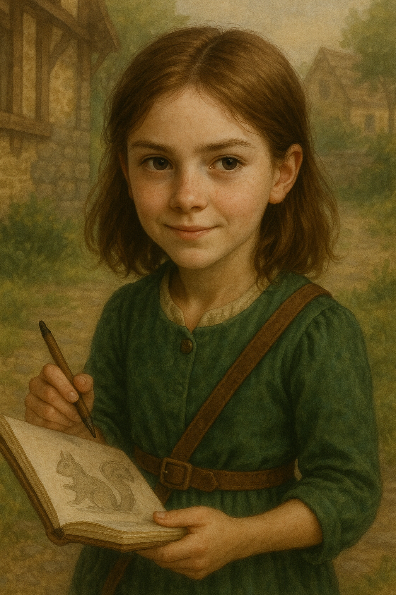

# Bryna Willowglen

**Age:** 11  
**Family:** Younger sister of [Jessica Willowglen](../jessica_willowglen/jessica_willowglen.md)  
**Residence:** Willowglen Family Home, Timberhearth  
**Affiliation:** The Willowglen Bakery  

---

## Personality

Bryna is clever, artistic, and quick-witted. Though she often acts aloof, she secretly admires her older sister, Jessica. She’s frequently seen sketching animals on scraps of parchment, especially near the edges of the market square or hiding behind crates at the bakery.

Her playful nature hides a deep curiosity and strong intuition. She’s especially fond of the neighborhood’s stray cats, and has been known to sneak them pastries when she thinks no one is looking.

---

## Appearance

Bryna has an expressive face, messy curls, and a smudge of charcoal on her fingers more often than not. She dresses in practical clothes with little embroidered touches she adds herself.

---

## Notable Events

- Known to sneak brambleberry pastries to stray cats around Timberhearth.
- Looks up to Jessica and sometimes mimics her behavior when no one is watching.
- Witnessed a brave moment when Jessica and Gabriel, along with Gabriel’s clever dog Poodler, fought off a sudden attack on Willowglen by Vendraxis. Creeping Wither pumpkins rolled through parts of the village, causing fright and mischief. Together, they helped protect their friends and neighbors, though sadly the town fountain was destroyed in the chaos. This event showed Bryna just how strong and courageous her family can be.
