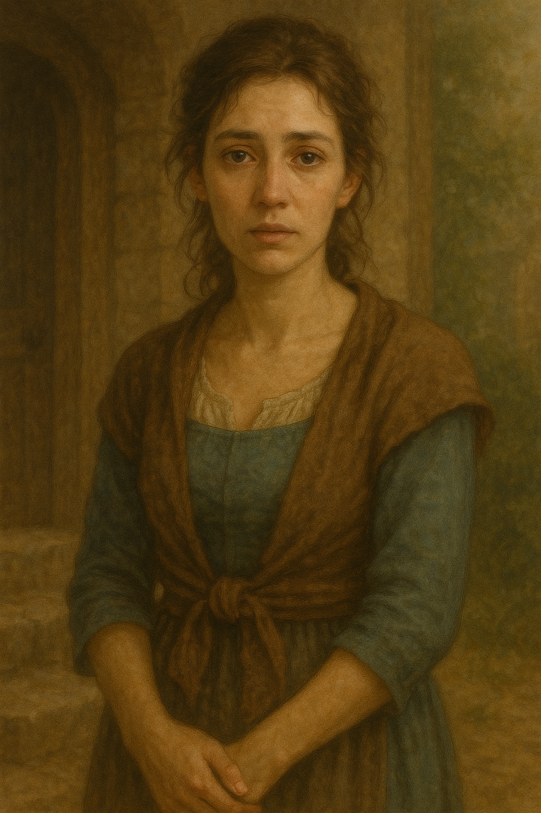

# Elaina Thatcher

**Age:** Early 30s  
**Family:** Mother of [Gabriel Thatcher](../gabriel_thatcher/gabriel_thatcher.md), Wife of [Thomas Thatcher](../thomas_thatcher/thomas-thatcher.md)  
**Residence:** Modest cottage in Timberhearth  
**Occupation:** Homemaker

---

## Personality

Elaina is a beautiful woman with a quiet strength and a deep weariness. Life has not been easy for her, and though she rarely complains, the signs of exhaustion rest beneath her eyes. She is gentle and nurturing, but firm when needed. Her love for her children runs deep, and she carries herself with a quiet grace even on the hardest days.

---

## Appearance

Elaina wears simple dresses suited to life in Timberhearth, often with a worn shawl over her shoulders. Her hair is usually tied back, and her eyes carry both warmth and fatigue.

---

## Notable Events

- Supports Gabriel with steady encouragement, despite the family’s limited means.
- Known in the village for her enduring beauty and quiet dignity, even when struggling with fatigue.
- Was present during the Night of Voices, where her son Gabriel was called to ascend the tower alongside Jessica Willowglen.
- Played a brave role during the Creeping Wither pumpkin attack, when the dark sorcerer Vendraxis unleashed a surprise assault on Timberhearth. Alongside her son Gabriel and his loyal dog, Poodler, she helped protect the village by bravely facing the glowing, creeping pumpkins that appeared in many streets. Though the team worked together to push the attackers back, the town fountain was sadly destroyed in the chaos, a reminder of the day they stood strong as a family and as a community.
