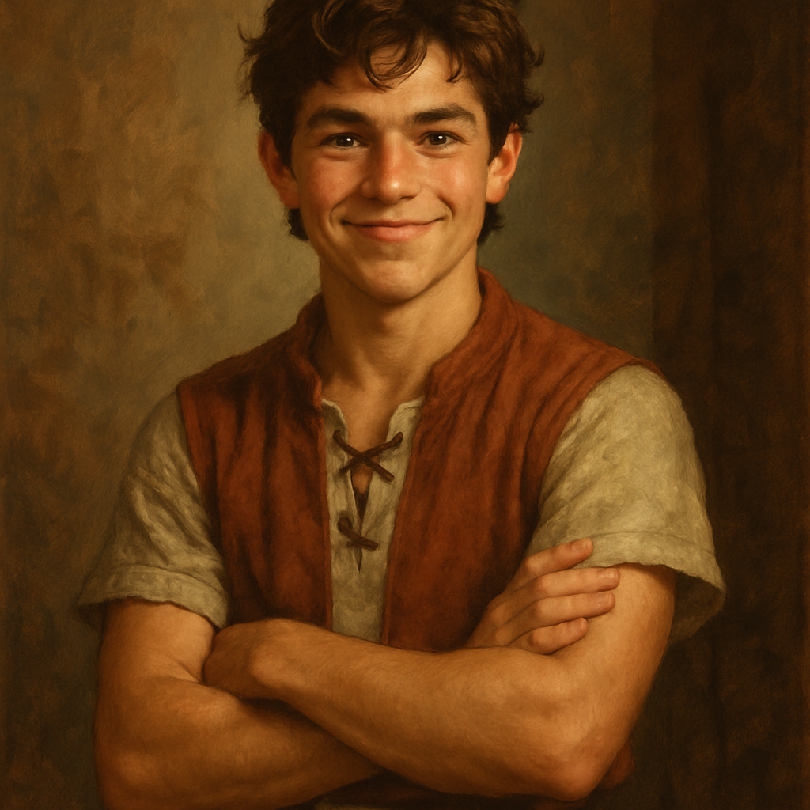

# [Gabriel](gabriel_thatcher.md) – Character Profile

## Basic Info
- **Full Name:** [Gabriel](gabriel_thatcher.md) Thatcher (surname inferred from family references)
- **Age:** 16
- **Birthdate:** Early summer, two days before [Jessica](../jessica_willowglen/jessica_willowglen.md)
- **Hometown:** Timberhearth
- **Family:**
  - Lives in a modest household known as the Thatchers
  - Father is a hardworking, quiet man with a strong sense of duty
  - Mother is gentle, practical, and often busy with chores
  - Has a younger brother named [Orrin](../orrin_thatcher/orrin-thatcher.md), who has a secret connection to the magical raccoons

## Personality & Traits
- **Strengths:** Dexterity, Intelligence
- **Neutrals:** Constitution, Wisdom
- **Weaknesses:** Strength, Charisma

[Gabriel](gabriel_thatcher.md) is curious, clever, and always hungry for knowledge. He has a boundless enthusiasm for learning how things work and a vivid imagination that sometimes gets ahead of practicality. Though not physically strong or naturally persuasive, he often finds creative solutions through logic and quick thinking.

## Short-Term Goal
- Learn a tiny bit of magic.

## Long-Term Goal
- Build a rocket and go to space (subject to in-world thematic adaptation).

## Gift from the Owl ([[Whistlewing](../whistlewing/whistlewing.md)](characters/whistlewing/whistlewing.md))
- **Object:** A dark crystal in the shape of a heart
- **Power:** The ability to bring people together
- **Growth Condition:** Must first cultivate this gift within himself

## Key Events
- Participated in the Night of Voices ceremony alongside [Jessica](../jessica_willowglen/jessica_willowglen.md).
- Met [[Whistlewing](../whistlewing/whistlewing.md)](characters/whistlewing/whistlewing.md), the mystical owl, and received his heart-shaped crystal.
- Agreed to help [[Mossel](../mossel_crabtree/mossel.md)](characters/mossel_crabtree/mossel.md) remove a tree stump in exchange for another visit to [[Whistlewing](../whistlewing/whistlewing.md)](characters/whistlewing/whistlewing.md).
- Visited [Ivan Ranger](../ivan_ranger/ivan-ranger.md)’s General Store:
  - Purchased a lantern (50 coalmarks)
- Visited [[Shanna Parsnip](../shanna_parsnip/shanna-parsnip.md)](characters/shanna_parsnip/shanna-parsnip.md), the town wisdom, to learn about magic.
- Investigated strange tracks near the bakery.
- At night, saw glowing eyes in the alley and fled in fear.
- The next morning, planned to make a bow and arrow.
- Was persuaded by [[Mossel](../mossel_crabtree/mossel.md)](characters/mossel_crabtree/mossel.md) to stay near the stump rather than go to the woods.
- Spent a full day helping [[Mossel](../mossel_crabtree/mossel.md)](characters/mossel_crabtree/mossel.md) dig up the stump.
- Returned to the alley that evening and encountered a synchronized group of raccoons, led by a cloaked raccoon with magical traits.
- Chose to follow the raccoons rather than the mysterious rooftop figure.
- Noticed the raccoon leader hiss defiantly before disappearing.

## Known Inventory
- Lantern (purchased for 50 coalmarks)
- Various sticks (gathered for bow-making)

## Notable Relationships
- **[Jessica](../jessica_willowglen/jessica_willowglen.md):** Close friend, born two days after him. The two share adventures and trust each other deeply.
- **[Orrin](../orrin_thatcher/orrin-thatcher.md):** Younger brother. Secretly involved with magical raccoons, though [Gabriel](gabriel_thatcher.md) doesn’t yet know the full extent.
- **[[Mossel](../mossel_crabtree/mossel.md)](characters/mossel_crabtree/mossel.md):** A town local who asked them to remove a stump; [Gabriel](gabriel_thatcher.md) gave him a pretzel and delayed the job with 200 coalmarks as collateral.
- **[[Whistlewing](../whistlewing/whistlewing.md)](characters/whistlewing/whistlewing.md):** Mysterious owl who gifted [Gabriel](gabriel_thatcher.md) a magical heart-shaped crystal.
- **[[Shanna Parsnip](../shanna_parsnip/shanna-parsnip.md)](characters/shanna_parsnip/shanna-parsnip.md):** Town wisdom and mentor figure who teaches about magic.

---
This file will be updated as [Gabriel](gabriel_thatcher.md)’s story continues.

---

[⬅ Back to Character Directory](../character-directory.md) | [🏠 Return to README](../../README.md)

## Notable Events
- On the Night of Voices, Gabriel was called up the tower together with Jessica—something unprecedented in Timberhearth tradition.
- He received a dark stone with a glowing ember at its core from Whistlewing, representing his potential to bring people together.
- His family gave him 65 coalmarks as a coming-of-age gift.
