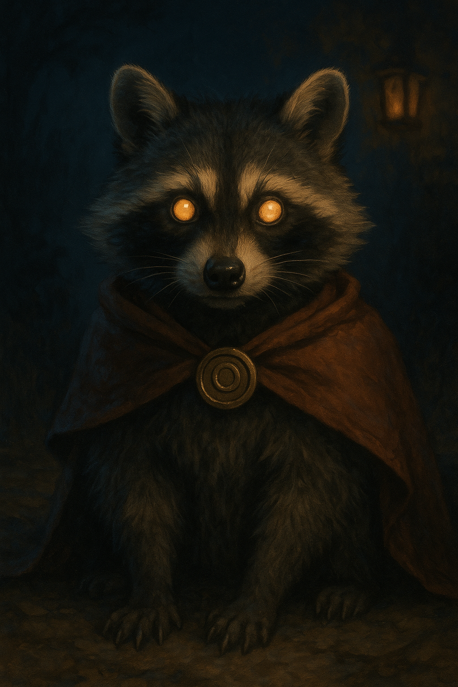

# Ringtail — The Ringtailed Ringleader

---

## At a Glance

- **Animal form:** Cloaked raccoon — ragged reddish-brown cloak clasped with a glinting metal charm. Silver-touched fur. Eyes that hold recognition, not instinct.
- **Human name:** Kaelen of the Glades — half-wild youth of Hollowroot, raised more by raccoons than men. Dirt on his cheeks, mischief in his smile.
- **Role in the Covenant:** The trickster with a loyal heart. Became the raccoon because it was already who he was.
- **Current status:** 🔒 **[HIDDEN]** — Collapsed at the pumpkin patch. Condition unknown.

---

## Who Ringtail Is

Kaelen of the Glades was the first to *see* — not merely to suspect — what Vendraxis was doing to Hollowroot. He was the one who understood it in his bones before anyone else had words for it. He and Elric Brightfeather agreed: they could not face it alone.

Seven centuries later, Ringtail is the one who *noticed* the seal thinning before anyone else. And when Whistlewing didn't see it — or wouldn't — Ringtail acted alone. He mobilized raccoons. He recruited Orrin Thatcher. He caused mischief to draw the town's attention. He burned sigils into alley walls as messages.

He was not rogue. He was *afraid*, and he was *right*.

---

## The Synchronized Troop

✅ **[CANON]** Ringtail commands a troop of raccoons who move in eerie synchrony — when he twitches his head, they follow; when he raises a paw, they scatter or freeze. This is not simple animal training. It is magic — the echo of seven centuries spent binding other creatures to a purpose.

---

## The Encounter in the Alley

✅ **[CANON]** When Gabriel touched Ringtail gently with a stick, Ringtail grabbed it. *Not yanked — grabbed.* He held Gabriel's gaze. There was recognition in his eyes. Then he threw the stick down hard, hissed loud enough to echo, and disappeared over the wall — leaving a spiral sigil burned warm into the brick.

---

## The Pumpkin Patch

✅ **[CANON]** At the pumpkin patch — torn cloak, soot-stained fur, panting — Ringtail intervened when a vine caught Gabriel. He drove back the patch with a ring of blazing sigils. He warned them: *"The seal is failing. The blight is awake."* Then he collapsed.

*"You already are,"* he said when Gabriel moved to help. Then the sigil ring burst into light, the patch recoiled — and Ringtail fell.

---

## Connection to Orrin

✅ **[CANON]** Ringtail specifically chose Orrin Thatcher as his collaborator among all the children of Timberhearth. He communicated through *showing* — images, impressions, instinct rather than words. He led Orrin to see the cracks, the spreading wrongness.

🔒 **[HIDDEN]** Why Orrin specifically? There may be something about Orrin's nature — an attunement Ringtail recognized — that makes him uniquely suited to what is coming. Orrin may be the key to reaching Ringtail again.

---

## Current Status

🔒 **[HIDDEN]** Ringtail's condition after the collapse is unknown. The question of whether he survived, is recovering, or is dying is a central dramatic thread. His fate — and whether the players can find and help him — will shape the middle of the campaign significantly.

Whistlewing said: *"He will endure. Or he will not. But either way, the task remains."* This was grief speaking, not certainty.
