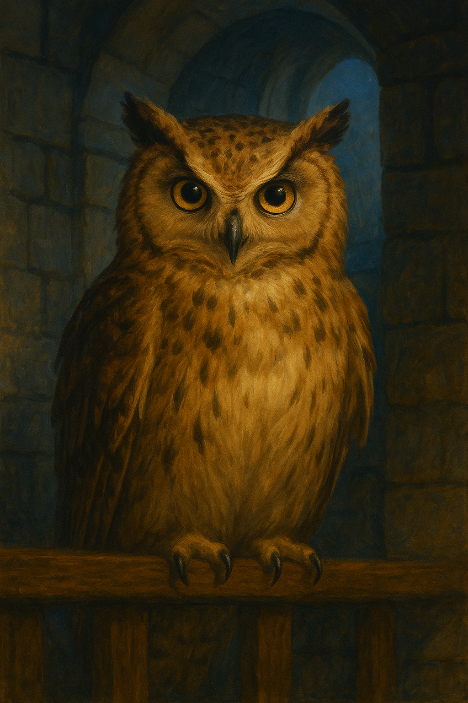

# Whistlewing — Guardian of the Clock Tower

---

## At a Glance

- **Animal form:** Great owl — nearly two feet tall, silver feathers, eyes like molten gold with faint ancient runes swirling in their depths
- **Human name:** Elric Brightfeather — scholar-clockmaker of Hollowroot Vale
- **Role in the Covenant:** Keeper of time and thought. Became the owl because he was meticulous, watchful, and made of patience.
- **Home:** The roost at the top of Timberhearth's clock tower

---

## What Whistlewing Is Like

Whistlewing thinks out loud when he believes no one is listening. He talks to the gargoyle. He frets. He paces. He is ancient and carries that weight — not heavily, but *steadily*, like a millstone turning. His voice does not come from his beak. It comes from within — heard not by ears, but by the heart.

He gives gifts. He gives warnings. He gives questions shaped as answers. He is never cruel but is not always comforting.

*"Sometimes, the shadows we fear are nothing more than someone else's light — seen from the wrong side."*

---

## Canon Events

✅ **[CANON]** Presided over the Night of Voices. Called Gabriel and Jessica together — *"Rare… but not unwelcome."* Gave each a gift. Asked them to investigate strange signs in the town and return in seven days.

✅ **[CANON]** On the second visit, told them about the suspicious movements — shadows, a figure on a rooftop with one boot on and one off. Directed them to investigate the village. Pointed them toward Shanna Parsnip.

✅ **[CANON]** On the third visit (after the pumpkin patch and Ringtail's collapse), revealed the full truth: the thirteen Guardians, the Covenant, the seal, and the fact that Gabriel and Jessica's gifts will lead them to those they are meant to find. *"Seek them in the woods, in the streets, in the places forgotten by time."*

---

## What Whistlewing Knows

👁️ **[REVEALED]** His true name (Elric Brightfeather), his role in the Covenant, the existence of the other twelve Guardians, the mechanics of the seal.

🔒 **[HIDDEN]** Whistlewing carries significant grief and uncertainty. He and Ringtail were friends — human friends — before the Covenant. Their current estrangement (Whistlewing long believing Ringtail had gone rogue) has been painful. Now that the truth has been revealed, Whistlewing must reckon with having misjudged his oldest companion. Ringtail's collapse at the pumpkin patch weighs on him in a way he hasn't shown the players.

🔒 **[HIDDEN]** Whistlewing is showing age. His feathers dulled at the edges when he spoke about Ringtail. He is not infinite. The seal's weakening drains the Guardians. If it continues to erode, Whistlewing himself may begin to fade.
