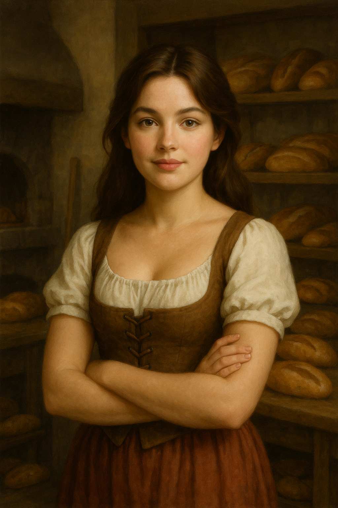

# [Jessica](jessica_willowglen.md) – Character Profile

## Basic Info
- **Full Name:** [Jessica](jessica_willowglen.md) Willowglen
- **Age:** 16
- **Birthdate:** Early summer, two days after [Gabriel](../gabriel_thatcher/gabriel_thatcher.md)
- **Hometown:** Timberhearth
- **Family:**
  - The Willowglen family, known for their wealth and generosity
  - Mother: [Maribel Willowglen](../maribel_willoglen/maribel-willowglen.md), renowned baker and wise listener
  - Younger sister: [[Bryna Willowglen](../bryna_willowglen/bryna-willowglen.md)](characters/bryna_willowglen/bryna-willowglen.md), age 11, artistically inclined and playful

## Personality & Traits
- **Strengths:** Wisdom, Charisma
- **Neutrals:** Constitution, Intelligence
- **Weaknesses:** Strength, Dexterity

[Jessica](jessica_willowglen.md) is kind-hearted, thoughtful, and driven by a strong sense of justice. She is intuitive and emotionally insightful, often considering the needs of others. Though not physically gifted, she possesses quiet strength and leadership through compassion.

## Short-Term Goal
- Share baked goods with poor people who don’t have food.

## Long-Term Goal
- Help all the people of Timberhearth have a safe home and all the food and supplies they need.

## Gift from the Owl ([[Whistlewing](../whistlewing/whistlewing.md)](characters/whistlewing/whistlewing.md))
- **Object:** A leaf made of stone with lace-like intricacy
- **Power:** The spark of nature within her

## Key Events
- Participated in the Night of Voices ceremony alongside [Gabriel](../gabriel_thatcher/gabriel_thatcher.md).
- Met [[Whistlewing](../whistlewing/whistlewing.md)](characters/whistlewing/whistlewing.md), the mystical owl, and received her magical stone leaf.
- Agreed to help [[Mossel](../mossel_crabtree/mossel.md)](characters/mossel_crabtree/mossel.md) remove a tree stump in exchange for another visit to [[Whistlewing](../whistlewing/whistlewing.md)](characters/whistlewing/whistlewing.md).
- Visited [Ivan Ranger](../ivan_ranger/ivan-ranger.md)’s General Store:
  - Purchased lantern oil (30 coalmarks)
- Visited [[Shanna Parsnip](../shanna_parsnip/shanna-parsnip.md)](characters/shanna_parsnip/shanna-parsnip.md), the town wisdom:
  - Learned about available spells and the concept of Moonsparks
  - Can choose from Prestidigitation, Wind Gust, or Whispercast
- Investigated strange tracks near her family’s bakery.
- At night, saw glowing eyes in the alley and fled with [Gabriel](../gabriel_thatcher/gabriel_thatcher.md).
- The next day, gathered snacks and set out to collect bow-making materials with [Gabriel](../gabriel_thatcher/gabriel_thatcher.md), but ended up helping [[Mossel](../mossel_crabtree/mossel.md)](characters/mossel_crabtree/mossel.md) with the stump.
- Returned to the alley at night and encountered the raccoons moving in synchronized formation.
  - Noticed a cloaked raccoon orchestrating the group.
  - Saw a mysterious cloaked figure on the rooftops but chose to follow the raccoons.
  - Used a piece of bread to try and record the raccoon’s claw mark using heat from a magical imprint.

## Known Inventory
- Lantern oil (purchased for 30 coalmarks)
- Bread with a charred imprint of a magical claw mark

## Notable Relationships
- **[Gabriel](../gabriel_thatcher/gabriel_thatcher.md):** Close friend, born two days before her. They trust and support each other deeply.
- **[Maribel Willowglen](../maribel_willoglen/maribel-willowglen.md):** Her wise and compassionate mother, known for giving excellent advice with snacks. [Jessica](jessica_willowglen.md) confides everything in her.
- **[[Bryna Willowglen](../bryna_willowglen/bryna-willowglen.md)](characters/bryna_willowglen/bryna-willowglen.md):** Younger sister with a mischievous streak who idolizes [Jessica](jessica_willowglen.md) from afar.
- **[[Mossel](../mossel_crabtree/mossel.md)](characters/mossel_crabtree/mossel.md):** Town local who tasked her and [Gabriel](../gabriel_thatcher/gabriel_thatcher.md) with stump removal.
- **[[Whistlewing](../whistlewing/whistlewing.md)](characters/whistlewing/whistlewing.md):** Mysterious owl who gifted her the stone leaf.
- **[[Shanna Parsnip](../shanna_parsnip/shanna-parsnip.md)](characters/shanna_parsnip/shanna-parsnip.md):** Town wisdom and magical guide.

---
This file will be updated as [Jessica](jessica_willowglen.md)’s story continues.

---

[⬅ Back to Character Directory](../character-directory.md) | [🏠 Return to README](../../README.md)

## Notable Events
- On the Night of Voices, Jessica was called up the tower together with Gabriel—something unprecedented in Timberhearth tradition.
- She received a delicate leaf-shaped charm with silver veins from Whistlewing, symbolizing the 'spark of nature' within her.
- Her family gave her 250 coalmarks as a coming-of-age gift.
