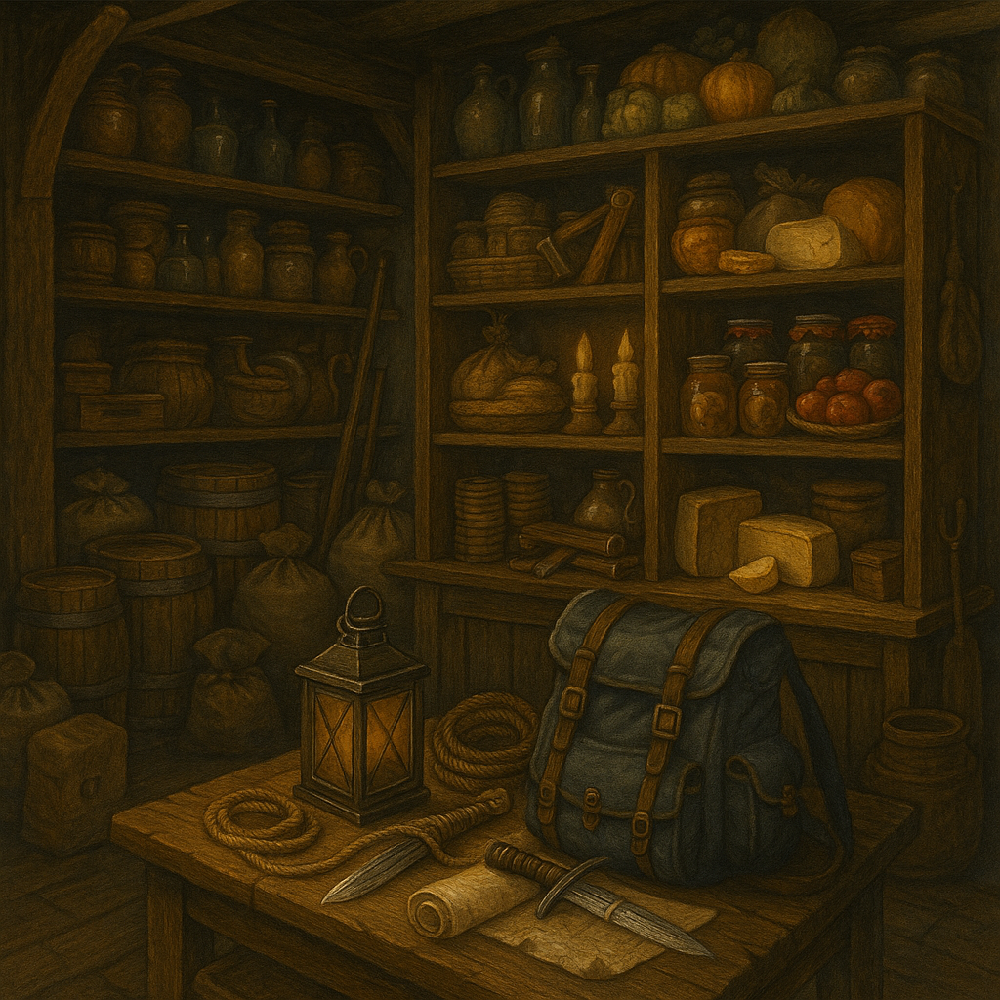

# Ivan Ranger — General Store

---

## Who He Is

Ivan Ranger runs Timberhearth's general store — a warm, slightly cluttered shop stocked with practical goods. He is distracted but kind, the sort of man who forgets where he put the invoice but never forgets a face.

---

## Transactions

✅ **[CANON]**

| Item | Buyer | Price |
|------|-------|-------|
| Lantern | Gabriel | 50 coalmarks |
| Lantern oil | Jessica | 30 coalmarks |
