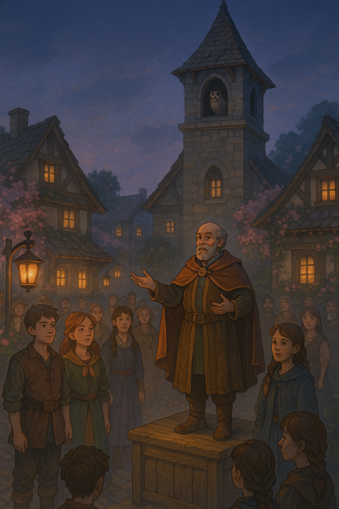

# Mayor Kempthorne

---

## Who He Is

Mayor Kempthorne is Timberhearth's mayor — resplendent at the Night of Voices in his burgundy coat and gold-trimmed sash, his kind eyes crinkling as if he were struggling not to smile. He has a deep, steady voice and the manner of someone who has been trusted with things for a long time.

---

## Role in the Campaign

✅ **[CANON]** Mayor Kempthorne presided over the Night of Voices ceremony. He gave the traditional speech — *"Let them go forth with courage, for though the climb is steep, the view from the top will guide their hearts"* — and gestured quietly to Gabriel and Jessica when they were called together, saying only: *"You're called."*

His brow furrowed *ever so slightly* at the unprecedented double-calling. But his voice remained calm.

🔒 **[HIDDEN]** How much does Kempthorne know? He has held this office long enough to have seen many Night of Voices ceremonies. The double-calling visibly unsettled him — which suggests he knows enough to understand that it means something. Whether he knows what is unclear. He bears watching.
