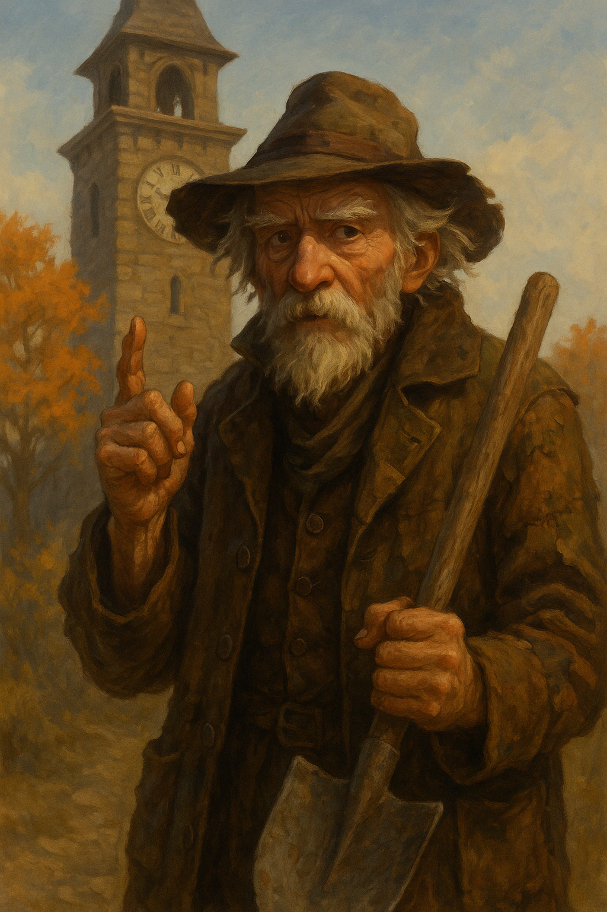

# Mossel Crabtree — Town Caretaker

---

## Who He Is

Mossel Ironhand tends Timberhearth with a slow, methodical devotion: flowerbeds, squeaky gates, cobblestones, and the general dignity of the village square. His broom is a fixture of the morning. He is gruff, principled, and not entirely comfortable with magic — but he respects tradition absolutely, and his respect has to be earned through action, not words.

He does not trust the clock tower. He trusts cobblestones.

---

## Relationship with the Players

✅ **[CANON]** At the Night of Voices, Mossel stopped Gabriel and Jessica from returning immediately to Whistlewing after the ceremony. He set a condition: clear the tree stump in the east meadow first. They accepted. He let them pass. The stump was cleared — and Mossel, against his better judgment, stepped aside and let them climb again.

*"Some doors don't open the same way twice,"* he told them.

When they returned, his frown softened — just slightly. They had kept their word. That was something.

✅ **[CANON]** After the Great Pumpkin Fray, Mossel acknowledged that Gabriel and Jessica's courage helped save the village from serious harm. From Mossel, this is high praise.

---

## Personality Notes

- Moves slowly and intentionally, like someone who has seen things rush past and regretted it.
- Believes in old ways. The pumpkin seed ban is not a joke to him.
- Protective of the village in a quiet, constant way — not dramatic, but reliable.
- More insightful than he first appears.

🔒 **[HIDDEN]** Mossel has noticed things in the past months — rot at the edges of his flowerbeds that comes back no matter how many times he digs it out, a vine on the square that withered overnight. He has not told anyone. He is the kind of man who acts rather than talks, and he doesn't yet know what action to take.
