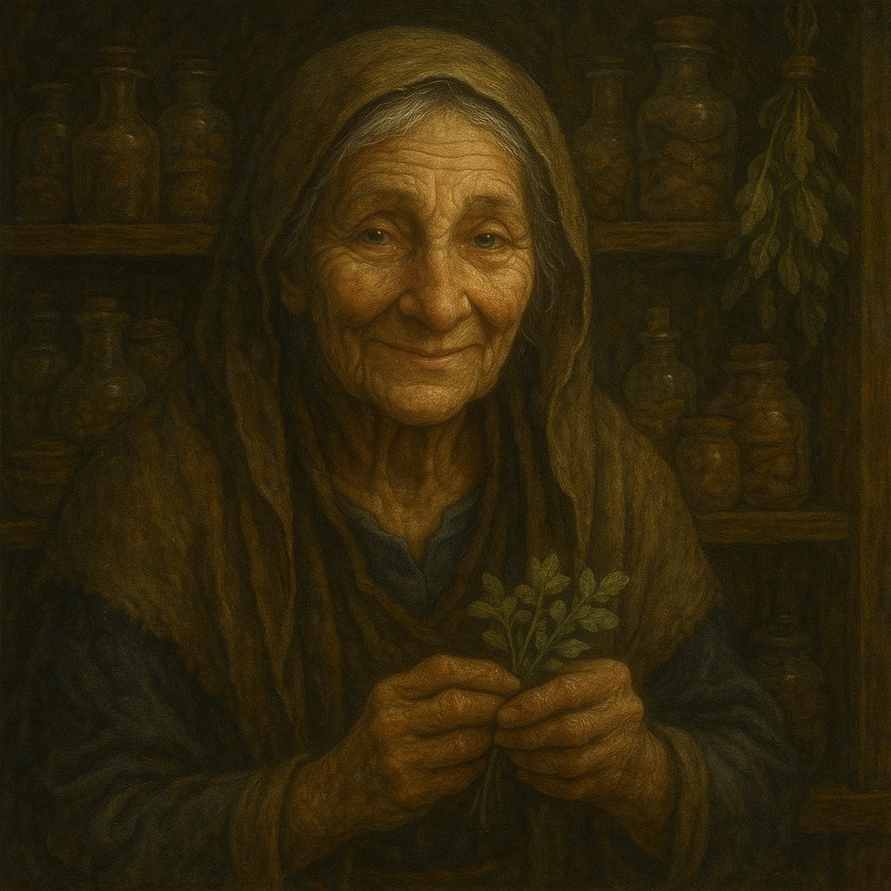

# Shanna Parsnip — The Town Wisdom

---

## Who She Is

Shanna Parsnip lives at the edge of the village, where the vines grow over the fenceposts and the wind smells of mint and ash. She is the **Wisdom** of Timberhearth — the town's keeper of magical knowledge and quiet guide to those with the spark. She is unhurried, soft-spoken, and seems to know more than she volunteers.

Whistlewing told Gabriel and Jessica: *"She lives where the vines grow over the fenceposts and the wind smells of mint and ash. Tonight is the full moon. When the first silver light touches the field outside her door, she will open it. Just once. If you wish to begin learning, you must be there."*

They were there.

---

## Role

✅ **[CANON]** Shanna teaches **Spark magic** (Moonspark). She opened her door to Gabriel and Jessica at the first full moon after their Night of Voices.

✅ **[CANON]** She taught them the concept of Moonsparks and the following cantrip-level spells: **Prestidigitation**, **Windgust**, and **Whispercast**.

---

## What She Knows

👁️ **[REVEALED]** She knows about magic, Moonsparks, and the basic structure of Spark spells. She teaches with patience and precision.

🔒 **[HIDDEN]** Shanna is not one of the thirteen Guardians — but she is not merely a magic teacher either. She carries knowledge passed down through a line of Wisdoms stretching back to the time of Hollowroot. She has been waiting — quietly, carefully — for the right young people to arrive at her door. She knows more about the seal, the Guardians, and Vendraxis than she has yet shared. She will share it when the time is right, and when she trusts that the players are ready for it.

What she chooses *not* to say is as important as what she does say.
