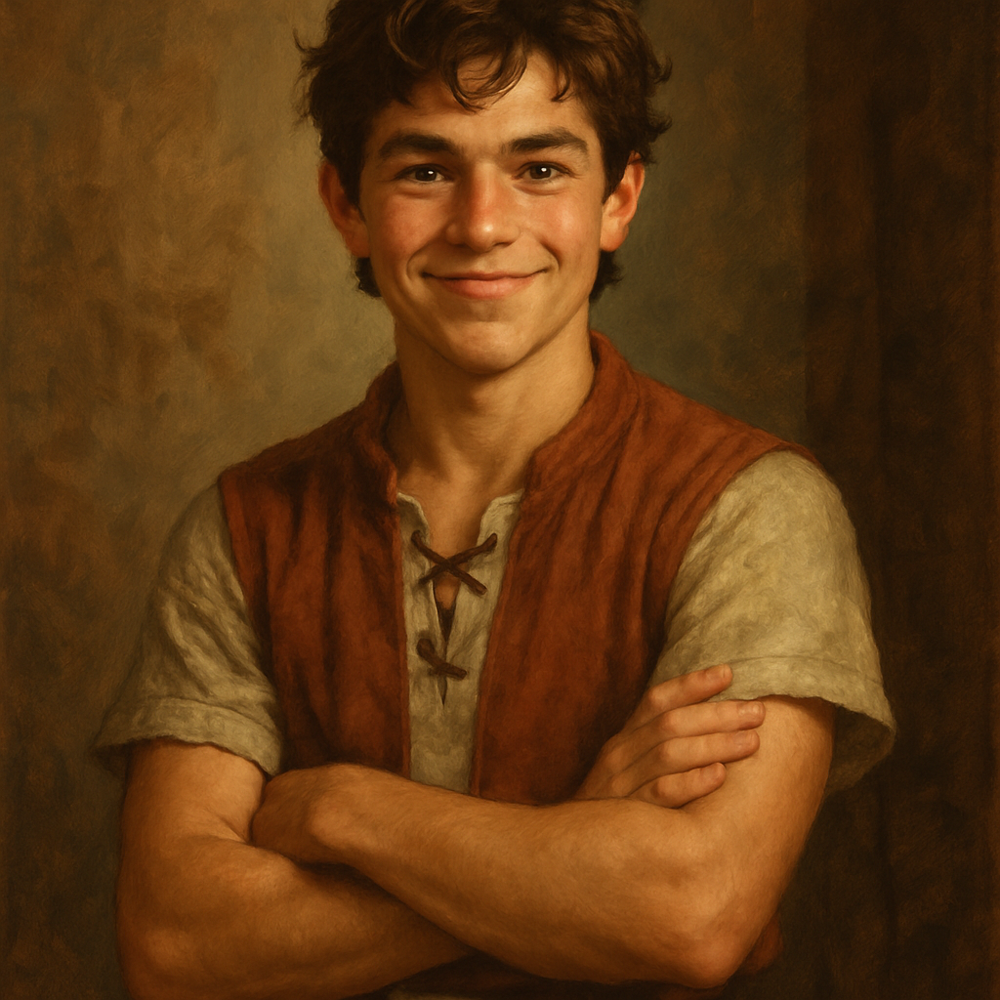

# Gabriel Thatcher

## At a Glance
- **Age:** 16
- **Birthday:** Early summer — two days before Jessica, before the end-of-July cutoff
- **Family:** Thatcher household (modest, hardworking, close-knit)
- **Best friend:** Jessica Willowglen

---

## Personality

Gabriel is curious, clever, and perpetually restless — always chasing the next idea, the next question, the next thing to take apart and understand. He doesn't have physical strength or natural charisma, but he solves problems through quick thinking, creative logic, and an imagination that regularly outruns practicality. He carries the quiet weight of his family's modest means — not with bitterness, but with a private hunger. He wants something no one can take from him. He wants magic.

**Strengths:** Dexterity, Intelligence
**Neutrals:** Constitution, Wisdom
**Weaknesses:** Strength, Charisma

---

## Goals

- **Short-term:** Learn a little magic. Something small and useful — the kind that could light a lantern, dry wet socks, make bread rise.
- **Long-term:** Build a rocket and go to space. (Subject to in-world thematic adaptation.)

---

## Whistlewing's Gift

✅ **[CANON]** At the Night of Voices, Whistlewing gave Gabriel a **dark crystal in the shape of a heart**, faintly luminous — lit from within. When his fingers closed around it, he felt a faint hum: like the echo of distant voices, soft and impossibly far away.

Whistlewing's words: *"It holds the power to bring people together. And yet, before you can use it well, you must first learn to gather the pieces of yourself."*

---

## Canon Events

✅ Called to Whistlewing **together with Jessica** at the Night of Voices — unprecedented.
✅ Received 65 coalmarks from his family as a coming-of-age gift.
✅ Visited **Ivan Ranger's General Store** and bought a lantern for 50 coalmarks.
✅ Made a deal with **Mossel Crabtree** — cleared the east meadow stump, left 200 coalmarks as collateral.
✅ Visited **Shanna Parsnip** to begin learning about magic.
✅ Investigated footprints. Encountered glowing eyes in the alley. Fled the first time.
✅ Returned to the alley. Encountered the **Ringtailed Ringleader** and his synchronized troop. Chose to **follow the raccoons** rather than the rooftop figure.
✅ Gently tapped the Ringleader with a stick. The Ringleader grabbed it, held his gaze with recognition — then hissed and vanished.
✅ Learned of Orrin's secret connection to the raccoons at the Willow River gathering.
✅ Witnessed the corrupted pumpkin patch. A vine caught his boot. Ringtail saved them.
✅ Learned the truth of the thirteen Guardians from Whistlewing.
✅ Carried the **orb of shadow** across Mira's bridge trial. Passed.
✅ Helped (with effort and muffins) put Gnarltooth's magical vest on Poodler.
✅ Witnessed Poodler's eight minutes of eloquent speech.
✅ Fought back Creeping Wither pumpkins during the Great Pumpkin Fray.

---

## Inventory

| Item | Notes |
|------|-------|
| Dark crystal heart | Gift from Whistlewing. Hums when the power stirs. |
| Lantern | Purchased from Ivan Ranger for 50 coalmarks. |
| Various sticks | Gathered for bow-making. The project stalled. |

---

## Coalmarks

| Transaction | Amount | Running Total |
|-------------|--------|---------------|
| Starting gift (Night of Voices) | +65 | 65 |
| Lantern (Ivan Ranger) | −50 | 15 |
| Mossel collateral | −200 | −185 (debt) |
| Collateral returned after stump job | +200 | 15 |

*Current estimate: ~15 coalmarks*

---

## Relationships

| Person | Relationship | Notes |
|--------|-------------|-------|
| [Jessica Willowglen](jessica-willowglen.md) | Best friend | Born two days after him. They share adventures and trust each other completely. |
| [Orrin Thatcher](../npcs/orrin-thatcher.md) | Younger brother | Has been secretly working with Ringtail for months. Gabriel didn't know until Session 3. |
| [Elaina Thatcher](../family/thatcher-family.md) | Mother | Practical and nurturing. Fights alongside Gabriel in the Great Pumpkin Fray. |
| [Thomas Thatcher](../family/thatcher-family.md) | Father | Stoic and hardworking. Strong sense of duty. |
| [Whistlewing](../guardians/whistlewing.md) | Mentor/mysterious guide | Has asked them to find the other Guardians. |
| [Mossel Crabtree](../npcs/mossel-crabtree.md) | Town caretaker | Gruff but fair. They've earned his grudging respect. |
| [Shanna Parsnip](../npcs/shanna-parsnip.md) | Magic teacher | Began instruction after the Night of Voices. |
| [Poodler](../family/thatcher-family.md) | Loyal dog | Spoke for eight minutes. Made the most of it. |
