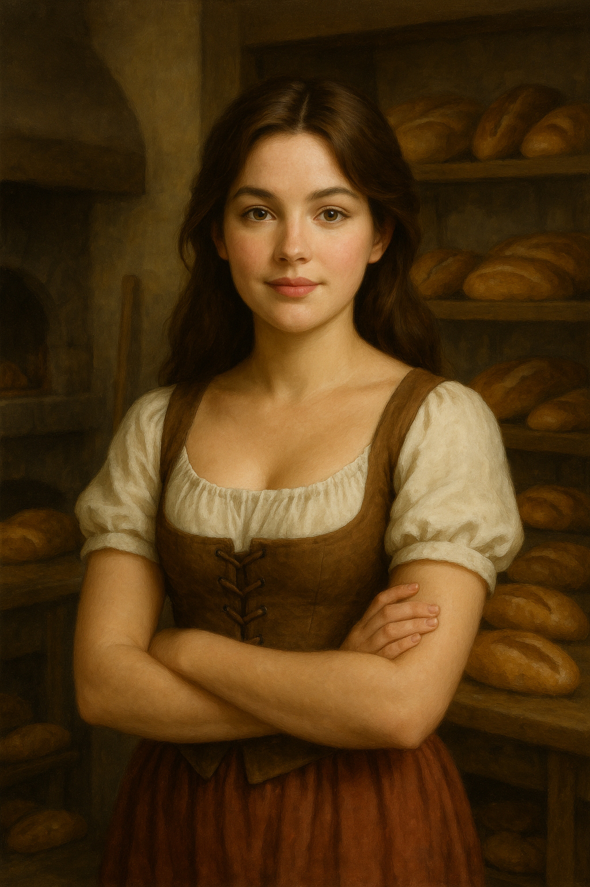

# Jessica Willowglen

## At a Glance
- **Age:** 16
- **Birthday:** Early summer — two days after Gabriel, before the end-of-July cutoff
- **Family:** Willowglen household (prosperous bakery family, warmth and generosity at its center)
- **Best friend:** Gabriel Thatcher

---

## Personality

Jessica is kind-hearted, thoughtful, and steady — the kind of person who measures things invisible before she speaks. She carries warmth in her hands and kindness in her eyes, and she has a quiet wildness too: the scent of rain on stone, an instinct for living things. She is intuitive and emotionally perceptive, often understanding what others need before they can say it. Physically she is not strong or fast, but she leads through compassion, and her courage shows up sideways — in not running, in pressing bread to hot brick, in following the raccoons.

**Strengths:** Wisdom, Charisma
**Neutrals:** Constitution, Intelligence
**Weaknesses:** Strength, Dexterity

---

## Goals

- **Short-term:** Share baked goods with people in Timberhearth who go without.
- **Long-term:** Help all the people of Timberhearth have a safe home, enough food, and what they need.

---

## Whistlewing's Gift

✅ **[CANON]** At the Night of Voices, Whistlewing gave Jessica a **stone leaf**, delicate and lace-like, as if carved by water and time. The moment her fingers touched it, warmth bloomed in her chest — not fire, but the steady glow of sunlight through leaves.

Whistlewing's words: *"This will remind you that even the smallest seed holds the power to grow, to heal, to endure."*

---

## Canon Events

✅ Called to Whistlewing **together with Gabriel** at the Night of Voices — unprecedented.
✅ Received 250 coalmarks from her family as a coming-of-age gift.
✅ Visited **Ivan Ranger's General Store** and purchased lantern oil for 30 coalmarks.
✅ Made a deal with **Mossel Crabtree** — cleared the east meadow stump.
✅ Visited **Shanna Parsnip** to begin learning about magic.
✅ Investigated footprints. Encountered glowing eyes in the alley. Fled the first time.
✅ Returned to the alley. Chose to **follow the raccoons** rather than the rooftop figure.
✅ Pressed bread to the still-warm brick where the Ringleader had stood, capturing a faint charred spiral imprint.
✅ Confided in her mother **Maribel**, who reacted with suppressed recognition.
✅ Witnessed and participated in the Willow River gathering where **Orrin** revealed his secret.
✅ Witnessed the corrupted pumpkin patch. A vine lashed at Gabriel. Ringtail saved them.
✅ Learned the truth of the thirteen Guardians from Whistlewing.
✅ Carried the **orb of light** across Mira's bridge trial. Passed — though a kitten distracted her balance.
✅ Received a **silver whisker** from Glowfern after passing the three trials of poise.
✅ Passed Glowfern's Trial of Grace, Trial of Patience, and Trial of Service.
✅ Fought back Creeping Wither pumpkins during the Great Pumpkin Fray.

---

## Inventory

| Item | Notes |
|------|-------|
| Stone leaf | Gift from Whistlewing. Pulses warm when nature magic stirs. |
| Lantern oil | Purchased from Ivan Ranger for 30 coalmarks. |
| Bread with charred spiral | Impression of Ringtail's sigil mark from the alley wall. |
| Silver whisker | Gift from Glowfern. *"Use it wisely — or humorously. Either is fine."* |

---

## Coalmarks

| Transaction | Amount | Running Total |
|-------------|--------|---------------|
| Starting gift (Night of Voices) | +250 | 250 |
| Lantern oil (Ivan Ranger) | −30 | 220 |

*Current estimate: ~220 coalmarks*

---

## Relationships

| Person | Relationship | Notes |
|--------|-------------|-------|
| [Gabriel Thatcher](gabriel-thatcher.md) | Best friend | Born two days before her. Partners in all of it. |
| [Maribel Willowglen](../family/willowglen-family.md) | Mother | Wise, warm, and knows more than she says. Jessica confides everything in her. |
| [Bryna Willowglen](../family/willowglen-family.md) | Younger sister (age 11) | Playful and artistic. Idolizes Jessica from a careful distance. |
| [Whistlewing](../guardians/whistlewing.md) | Mentor/mysterious guide | Identified Jessica's spark early. Asked them to find the other Guardians. |
| [Mossel Crabtree](../npcs/mossel-crabtree.md) | Town caretaker | They've earned his grudging respect. |
| [Shanna Parsnip](../npcs/shanna-parsnip.md) | Magic teacher | Opened her door at first full moon after the Night of Voices. |
